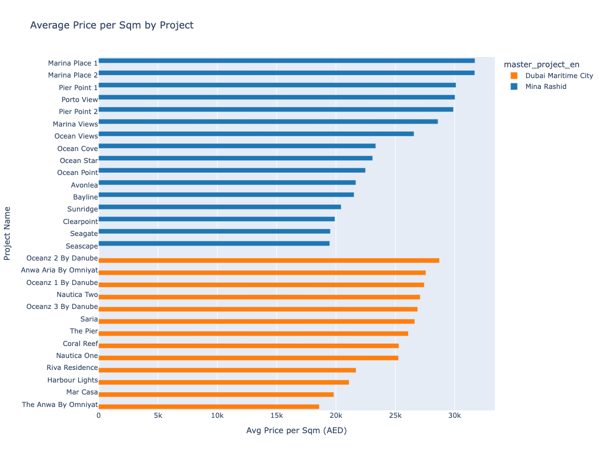
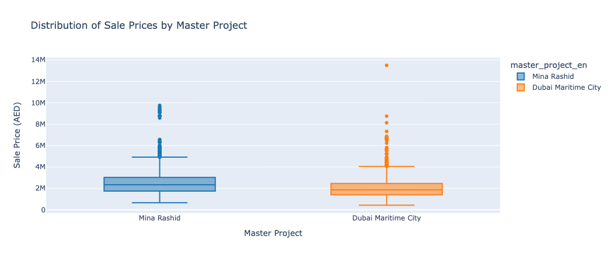
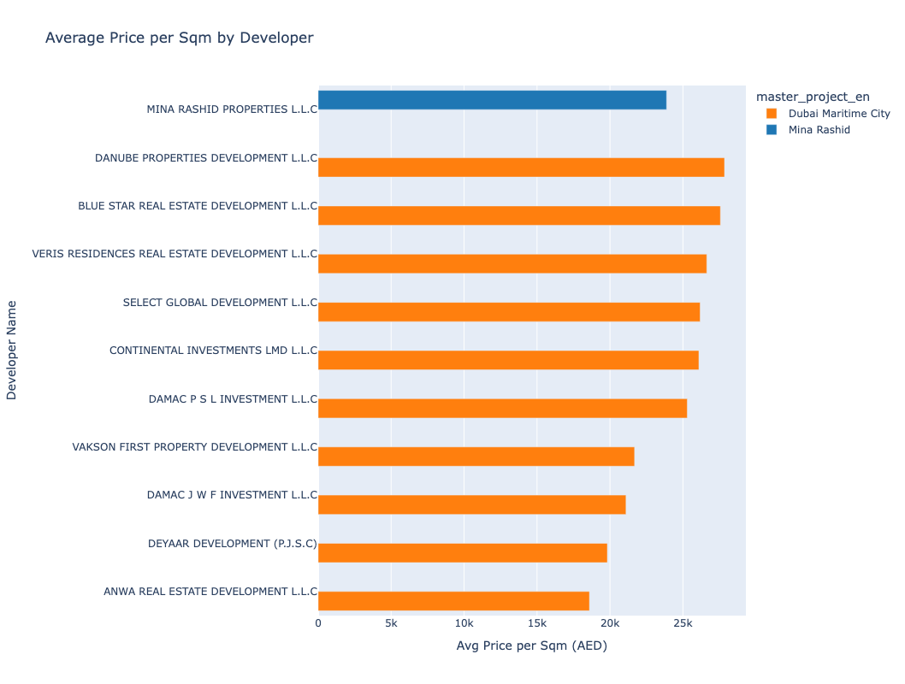
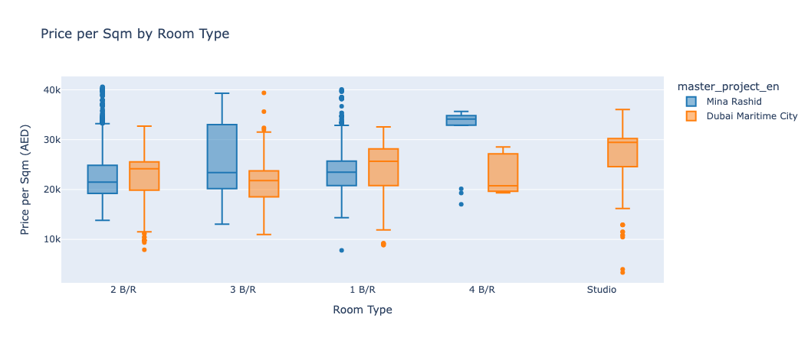
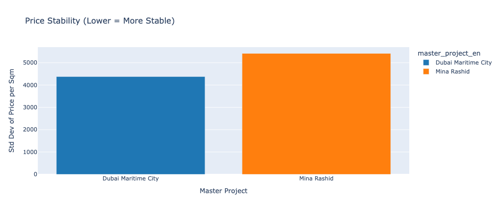
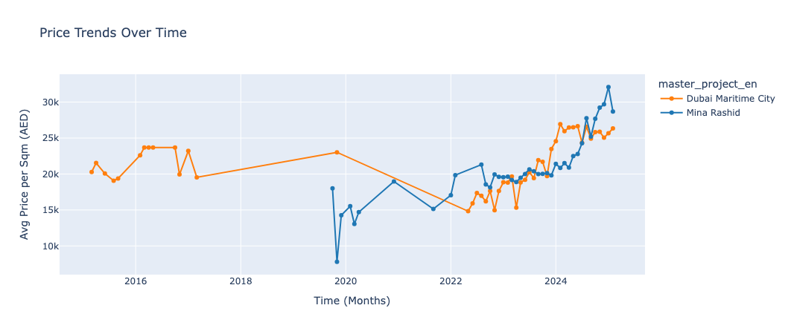
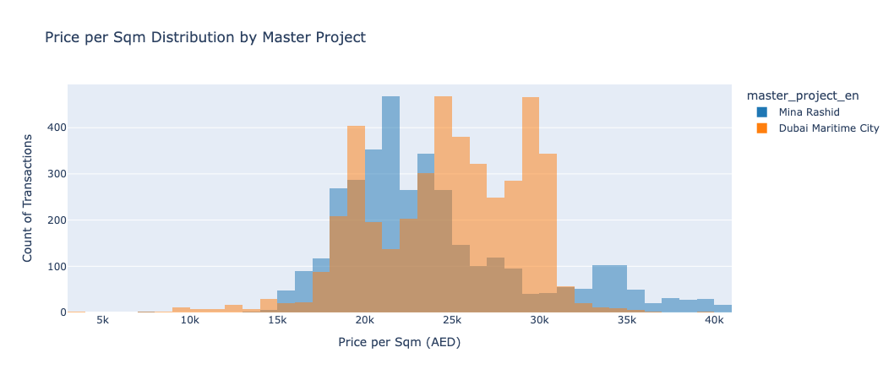
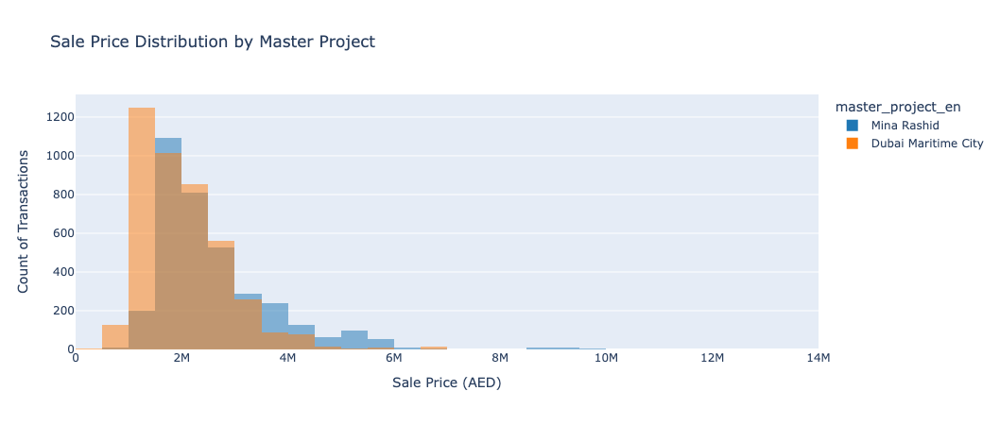

# Real Estate Market Analysis: Mina Rashid & Dubai Maritime City

## 📌 Project Overview

This project provides an in-depth analysis of real estate transactions in Mina Rashid and Dubai Maritime City, two emerging real estate hubs in Dubai, UAE. The study aims to help real estate investors, agents, and analysts understand property price trends, rental yields, and investment potential in these areas.

## 📊 Datasets Used

**Real Estate Transactions Dataset**

- Covers property sales and mortgages from multiple years.
  
- Contains price per sqm, transaction value, property type, and location data.
  
- Helps identify market trends, pricing variations, and investment patterns.

---

## 🔍 Key Insights

### 1️⃣ Property Prices & Sales Trends

- Mina Rashid's median price per sqm: **AED 23,967**.
  
- Dubai Maritime City's median price per sqm: **AED 25,013**.
  
- Sales are **dominated by off-plan properties (~95%)**.

**📊 Price per Sqm by Project**

**📊 Distribution of Sale Prices by Master Project**

---

### 2️⃣ Most Expensive Developers & Projects

- **Top Developers**: Danube Properties, Omniyat, Damac.
  
- **Highest price per sqm**: "Oceanz 2 By Danube" and "Marina Place 1".

**📊 Price per Sqm by Developer**

---

**📊 Price per Sqm by Room Type**

---

### 4️⃣ Investment Potential & Market Stability

- **Price Stability**: Dubai Maritime City shows lower price volatility, making it more stable.
  
- **Price Growth Trends**: Both areas show strong appreciation trends in 2023-2024.
  
- **Best investment strategy**: Long-term rentals in Mina Rashid and flipping properties in Dubai Maritime City.

**📊 Price Stability**

**📊 Price Trends Over Time**

**📊 Price per Sqm Distribution by Master Project**

**📊 Sale Distribution Histogram by Master Project**

